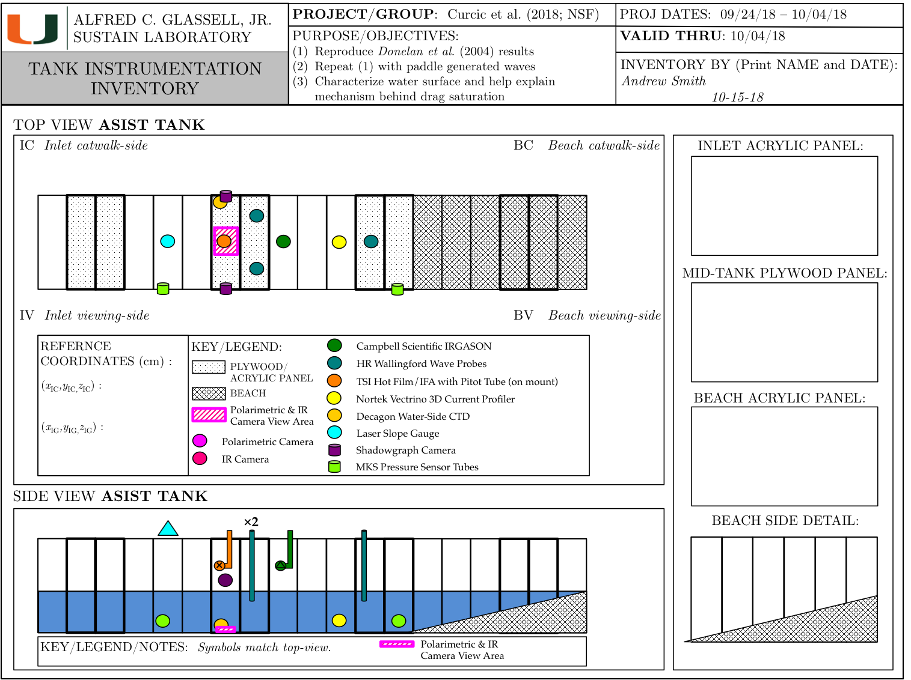

# ASIST-NSF-2018

Processing data from the ASIST-NSF-2018 experiment

## Getting started

```
pip install --process-dependency-links git+https://github.com/sustain-lab/asist-nsf-2018
```

## Notebooks

* [Reading experiments metadata](https://github.com/sustain-lab/asist-nsf-2018/blob/master/notebooks/reading-experiment-metadata.ipynb)
* [Processing IRGASON data to NetCDF](https://github.com/sustain-lab/asist-nsf-2018/blob/master/notebooks/processing-irgason-L1-to-L2.ipynb)
* [Processing hot-film data to NetCDF](https://github.com/sustain-lab/asist-nsf-2018/blob/master/notebooks/processing-hotfilm-L1-to-L2.ipynb)
* [Processing pitot data to NetCDF](https://github.com/sustain-lab/asist-nsf-2018/blob/master/notebooks/processing-pitot-L1-to-L2.ipynb)
* Fitting hotfilm data to pitot, [fresh](https://github.com/sustain-lab/asist-nsf-2018/blob/master/notebooks/fitting-hotfilm-to-pitot-fresh.ipynb) 
and [salt](https://github.com/sustain-lab/asist-nsf-2018/blob/master/notebooks/fitting-hotfilm-to-pitot-salt.ipynb) water

## Instruments



## Experiments

All times are in UTC.

### Fresh water, wind only, warm-up (`asist-windonly-fresh-warmup`)

Fan [Hz] | Start time | End time
---------|------------|---------
00 | 2018-09-24 19:10:00 | 2018-09-24 19:16:00
05 | 2018-09-24 19:16:00 | 2018-09-24 19:22:00
10 | 2018-09-24 19:22:00 | 2018-09-24 19:28:00
15 | 2018-09-24 19:28:00 | 2018-09-24 19:34:00
20 | 2018-09-24 19:34:00 | 2018-09-24 19:40:00
25 | 2018-09-24 19:40:00 | 2018-09-24 19:46:00
30 | 2018-09-24 19:46:00 | 2018-09-24 19:52:00
35 | 2018-09-24 19:52:00 | 2018-09-24 19:58:00
40 | 2018-09-24 19:58:00 | 2018-09-24 20:04:00
45 | 2018-09-24 20:04:00 | 2018-09-24 20:10:00
50 | 2018-09-24 20:10:00 | 2018-09-24 20:16:00
55 | 2018-09-24 20:16:00 | 2018-09-24 20:22:00
60 | 2018-09-24 20:22:00 | 2018-09-24 20:28:00
00 | 2018-09-24 20:28:00 | 2018-09-24 20:34:00

### Fresh water, wind only  (`asist-windonly-fresh`)

Fan [Hz] | Start time | End time
---------|------------|---------
00 | 2018-09-26 19:18:00 | 2018-09-26 19:24:00
05 | 2018-09-26 19:24:00 | 2018-09-26 19:30:00
10 | 2018-09-26 19:30:00 | 2018-09-26 19:36:00
15 | 2018-09-26 19:36:00 | 2018-09-26 19:42:00
20 | 2018-09-26 19:42:00 | 2018-09-26 19:48:00
25 | 2018-09-26 19:48:00 | 2018-09-26 19:54:00
30 | 2018-09-26 19:54:00 | 2018-09-26 20:00:00
35 | 2018-09-26 20:00:00 | 2018-09-26 20:06:00
40 | 2018-09-26 20:06:00 | 2018-09-26 20:12:00
45 | 2018-09-26 20:12:00 | 2018-09-26 20:18:00
50 | 2018-09-26 20:18:00 | 2018-09-26 20:24:00
55 | 2018-09-26 20:24:00 | 2018-09-26 20:30:00
60 | 2018-09-26 20:30:00 | 2018-09-26 20:36:00
00 | 2018-09-26 20:36:00 | 2018-09-26 20:42:00

### Fresh water, wind + swell (`asist-wind-swell-fresh`)

Fan [Hz] | Start time | End time
-------- | -------- | --------
00 | 2018-09-27 14:42:00 | 2018-09-27 14:48:00
05 | 2018-09-27 14:48:00 | 2018-09-27 14:54:00
10 | 2018-09-27 14:54:00 | 2018-09-27 15:00:00
15 | 2018-09-27 15:00:00 | 2018-09-27 15:06:00
20 | 2018-09-27 15:06:00 | 2018-09-27 15:12:00
25 | 2018-09-27 15:12:00 | 2018-09-27 15:18:00
30 | 2018-09-27 15:18:00 | 2018-09-27 15:24:00
35 | 2018-09-27 15:24:00 | 2018-09-27 15:30:00
40 | 2018-09-27 15:30:00 | 2018-09-27 15:36:00
45 | 2018-09-27 15:36:00 | 2018-09-27 15:42:00
50 | 2018-09-27 15:42:00 | 2018-09-27 15:48:00
55 | 2018-09-27 15:48:00 | 2018-09-27 15:54:00
60 | 2018-09-27 15:54:00 | 2018-09-27 16:00:00
00 | 2018-09-27 16:00:00 | 2018-09-27 16:06:00

### Salt water, wind only (`asist-windonly-salt`)

Fan [Hz] | Start time | End time
-------- | -------- | --------
00 | 2018-10-01 17:20:00 | 2018-10-01 17:26:00
05 | 2018-10-01 17:26:00 | 2018-10-01 17:32:00
10 | 2018-10-01 17:32:00 | 2018-10-01 17:38:00
15 | 2018-10-01 17:38:00 | 2018-10-01 17:44:00
20 | 2018-10-01 17:44:00 | 2018-10-01 17:50:00
25 | 2018-10-01 17:50:00 | 2018-10-01 17:56:00
30 | 2018-10-01 17:56:00 | 2018-10-01 18:02:00
35 | 2018-10-01 18:02:00 | 2018-10-01 18:08:00
40 | 2018-10-01 18:08:00 | 2018-10-01 18:14:00
45 | 2018-10-01 18:14:00 | 2018-10-01 18:20:00
50 | 2018-10-01 18:20:00 | 2018-10-01 18:26:00
55 | 2018-10-01 18:26:00 | 2018-10-01 18:32:00
60 | 2018-10-01 18:32:00 | 2018-10-01 18:38:00
00 | 2018-10-01 18:38:00 | 2018-10-01 18:44:00

### Salt water, wind + swell (`asist-wind-swell-salt`)

Fan [Hz] | Start time | End time
-------- | -------- | --------
00 | 2018-10-01 19:54:00 | 2018-10-01 20:00:00
05 | 2018-10-01 20:00:00 | 2018-10-01 20:06:00
10 | 2018-10-01 20:06:00 | 2018-10-01 20:12:00
15 | 2018-10-01 20:12:00 | 2018-10-01 20:18:00
20 | 2018-10-01 20:18:00 | 2018-10-01 20:24:00
25 | 2018-10-01 20:24:00 | 2018-10-01 20:30:00
30 | 2018-10-01 20:30:00 | 2018-10-01 20:36:00
35 | 2018-10-01 20:36:00 | 2018-10-01 20:42:00
40 | 2018-10-01 20:42:00 | 2018-10-01 20:48:00
45 | 2018-10-01 20:48:00 | 2018-10-01 20:54:00
50 | 2018-10-01 20:54:00 | 2018-10-01 21:00:00
55 | 2018-10-01 21:00:00 | 2018-10-01 21:06:00
60 | 2018-10-01 21:06:00 | 2018-10-01 21:12:00
00 | 2018-10-01 21:12:00 | 2018-10-01 21:18:00

### Fresh water, wind only, flow distortion (`asist-flow-distortion`)

Fan [Hz] | Start time | End time
-------- | -------- | --------
00 | 2018-10-02 17:56:00 | 2018-10-02 17:58:00
05 | 2018-10-02 17:58:00 | 2018-10-02 18:00:00
10 | 2018-10-02 18:00:00 | 2018-10-02 18:02:00
15 | 2018-10-02 18:02:00 | 2018-10-02 18:04:00
20 | 2018-10-02 18:04:00 | 2018-10-02 18:06:00
25 | 2018-10-02 18:06:00 | 2018-10-02 18:08:00
30 | 2018-10-02 18:08:00 | 2018-10-02 18:10:00
35 | 2018-10-02 18:10:00 | 2018-10-02 18:12:00
40 | 2018-10-02 18:12:00 | 2018-10-02 18:14:00
45 | 2018-10-02 18:14:00 | 2018-10-02 18:16:00
50 | 2018-10-02 18:16:00 | 2018-10-02 18:18:00
55 | 2018-10-02 18:18:00 | 2018-10-02 18:20:00
60 | 2018-10-02 18:20:00 | 2018-10-02 18:22:00
00 | 2018-10-02 18:22:00 | 2018-10-02 18:24:00

### Fresh water, wind only, vertical profile (`asist-vertical-profile`)

Fan [Hz] | Start time | End time
-------- | -------- | --------
30 | 2018-10-02 20:50:00 | 2018-10-02 20:52:00
30 | 2018-10-02 20:52:00 | 2018-10-02 20:54:00
30 | 2018-10-02 20:54:00 | 2018-10-02 20:56:00
30 | 2018-10-02 20:56:00 | 2018-10-02 20:58:00
30 | 2018-10-02 20:58:00 | 2018-10-02 21:00:00
30 | 2018-10-02 21:00:00 | 2018-10-02 21:02:00
30 | 2018-10-02 21:02:00 | 2018-10-02 21:04:00
30 | 2018-10-02 21:04:00 | 2018-10-02 21:06:00
30 | 2018-10-02 21:06:00 | 2018-10-02 21:08:00
30 | 2018-10-02 21:08:00 | 2018-10-02 21:10:00

### Fresh water, wind only, cross-tank profile (`asist-crosstank-profile`)

Fan [Hz] | Start time | End time
-------- | -------- | --------
30 | 2018-10-04 19:00:00 | 2018-10-04 19:01:00
30 | 2018-10-04 19:02:00 | 2018-10-04 19:03:00
30 | 2018-10-04 19:04:00 | 2018-10-04 19:05:00
30 | 2018-10-04 19:06:00 | 2018-10-04 19:07:00
30 | 2018-10-04 19:08:00 | 2018-10-04 19:09:00
30 | 2018-10-04 19:10:00 | 2018-10-04 19:11:00
30 | 2018-10-04 19:12:00 | 2018-10-04 19:13:00
30 | 2018-10-04 19:14:00 | 2018-10-04 19:15:00
30 | 2018-10-04 19:16:00 | 2018-10-04 19:17:00
30 | 2018-10-04 19:18:00 | 2018-10-04 19:19:00
30 | 2018-10-04 19:20:00 | 2018-10-04 19:21:00
30 | 2018-10-04 19:22:00 | 2018-10-04 19:23:00
30 | 2018-10-04 19:24:00 | 2018-10-04 19:25:00
30 | 2018-10-04 19:26:00 | 2018-10-04 19:27:00
30 | 2018-10-04 19:28:00 | 2018-10-04 19:29:00
30 | 2018-10-04 19:30:00 | 2018-10-04 19:31:00
30 | 2018-10-04 19:32:00 | 2018-10-04 19:33:00
30 | 2018-10-04 19:34:00 | 2018-10-04 19:35:00
30 | 2018-10-04 19:36:00 | 2018-10-04 19:37:00
30 | 2018-10-04 19:38:00 | 2018-10-04 19:39:00
30 | 2018-10-04 19:40:00 | 2018-10-04 19:41:00
30 | 2018-10-04 19:42:00 | 2018-10-04 19:43:00
30 | 2018-10-04 19:44:00 | 2018-10-04 19:45:00

